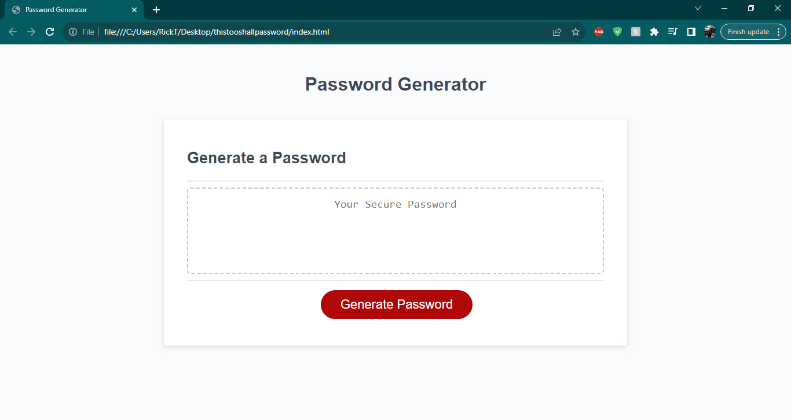
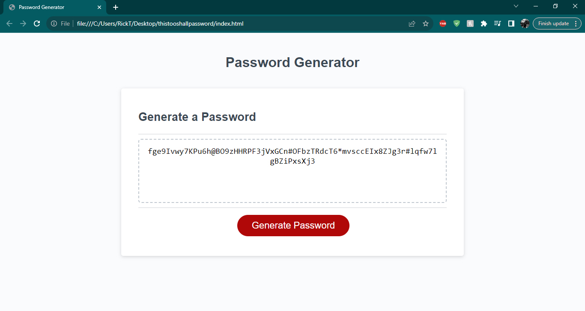

# Password Generator

## Description

Just a very basic password generator. You "click" the Generate button and you'll be first asked to select how many characters
you want you password to be and from there confirm all the choices to build a strong password. 

## Table of Contents 

- [Installation](#installation)
- [Usage](#usage)
- [Credits](#credits)

## Installation

Only Google Chrome or any other browswer that support HTML/JAVASCRIPT will support this app. Nothing else needs to be installed.

## Usage

First, go to the deployed app. Located: https://rtocastro.github.io/thistooshallpassword/

Then, you'll click the "Generate" button

After, you'll confirm the choices to make sure you are creating a "Secure" and strong password. If not, you'll have nothing generated. 

Then, you'll have a generated password with all the requirements for secure password.

*note* if you choose more characters the more secure your password will be. I got with 24 characters for a SOLID and SECURE password.

    ```md
    
    
    ```

## Credits

Credits go to BCS activities pages where I drew some of the information from. I was also tutored by Corrado who helped me understand the syntax and how to use it. Also, my last reference was a few websites including MDN, StackOverflow and Javascriptinplainenglish. 

And of course, Luigi Campbell my instructor.


